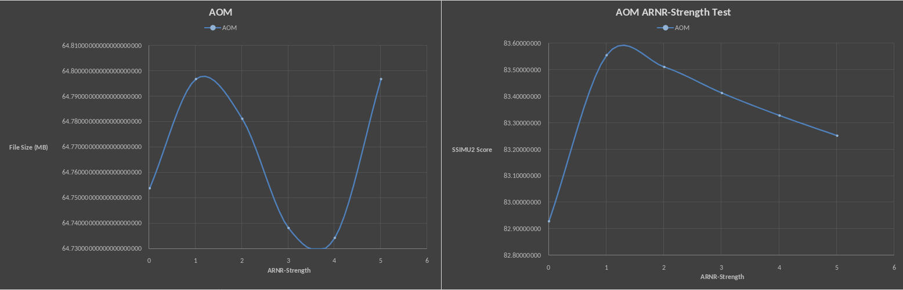

## LibAOM-lavish: Impact of arnr-strength
### Graphs


Left: Filesize at each ARNR-Strength level.  
Right: SSIMU2 score at ecah ARNR-Strength level.

### Information
Encoder used: `aom-av1-lavish-git r33040.83500ccf3-1`  
Parameters used:
```
--end-usage=q --cpu-used=3 --cq-level=21 --threads=2 --enable-cdef=0 --aq-mode=0 --enable-qm=1 --lag-in-frames=64 --arnr-strength=$ARNR --arnr-maxframes=15 --sharpness=0 --quant-sharpness=0 --disable-trellis-quant=0 --enable-fwd-kf=1 --min-q=1 --deltaq-mode=1 --bit-depth=10 --tune-content=psy --enable-chroma-deltaq=1 --tune=ssim --sb-size=dynamic --quant-b-adapt=1  
```
Resulting data: [Can be downloaded here in CSV format](./data.csv)  
Script used: [Can be found here](./run-test.sh)  

### Interpretation
As we can see, the filesize impact of `arnr-strength` is pretty much neglible.  
Interesting to see is that its the highest at `arnr-strength=1`, while it's lowest at `arnr-strength=4`

However what we want to take a look at is the SSIMU2 score.
Using `arnr-strength=1` nets the highest SSIMU2 score. While it linearly drops from 2 to 5. Setting `arnr-strength=0` leaves us with the lowest SSIMU2 score.

### Recommendation
As filesize impacts are neglible, we want the highest possible SSIMU2 score here. And that happens to be on `arnr-strength=1`.