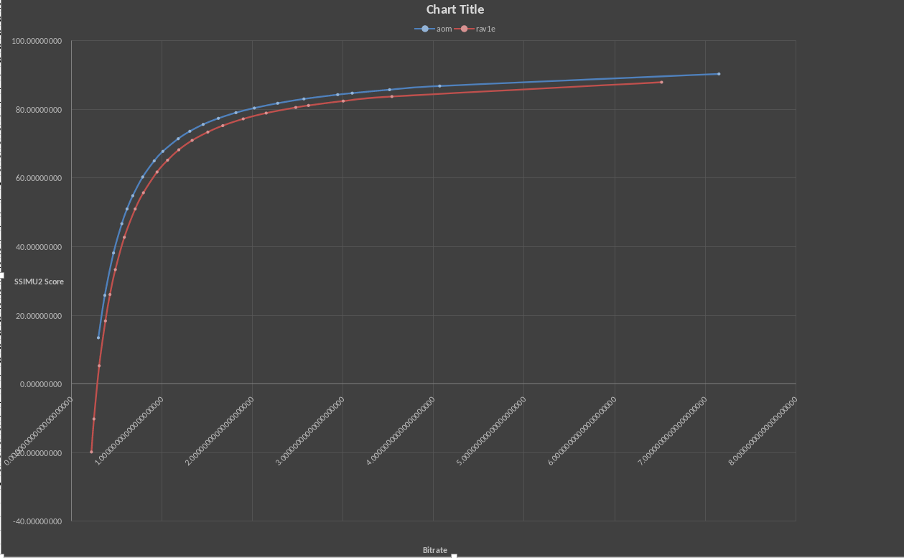

## LibAOM-lavish: Impact of arnr-strength
### Graphs


SSIMU2 score at a given Bitrate (in MB/s)

### Information
Encoder used: `aom-av1-lavish-git r33040.83500ccf3-1`  
Resulting data: [Can be downloaded here in CSV format](./data.csv)  
Script used: [Can be found here](./run-test.sh)  

#### Parameters used
libAOM-lavish:
```
--end-usage=q --cpu-used=3 --cq-level=$Q --threads=2 --enable-cdef=0 --aq-mode=0 --enable-qm=1 --lag-in-frames=64 --arnr-strength=1 --arnr-maxframes=15 --sharpness=0 --quant-sharpness=0 --disable-trellis-quant=0 --enable-fwd-kf=1 --min-q=1 --deltaq-mode=1 --bit-depth=10 --tune-content=psy --enable-chroma-deltaq=1 --tune=ssim --sb-size=dynamic --quant-b-adapt=1
```
rav1e:
```
--speed 2 --threads 2 --quantizer $(($Q * 4)) --keyint 0 --no-scene-detection
```

### Interpretation
As everyone I know had already guessed, rav1e is worse at efficiency throughout the entire scale.  
Especially at super low bitrates, rav1e runs down into the negative scores of SSIMU2. But not only that is  problem, rav1e is also *incredibly* slow, performing about 3 times slower than libaom on my machine.

### Recommendation
If you want your anime encodes to look good, whether you aim for high fidelity or small encodes, libaom should be your choice.
